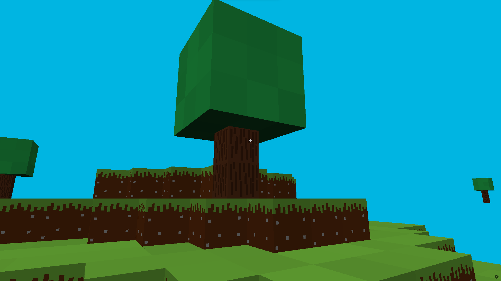

# Pyinecraft 2.0

Pyinecraft is a simple minecraft clone made with Python.

## Bugs

1. Sometimes you will be stuck (You cannot move or jump)
   You will need to break a block.
   
## How To Play:

1 = Grass  
2 = Dirt  
3 = Stone  
4 = Cobblestone  
5 = Sand  
6 = Log  
7 = Planks  
8 = Obsidian  
9 = Ice  

### Screenshots:

