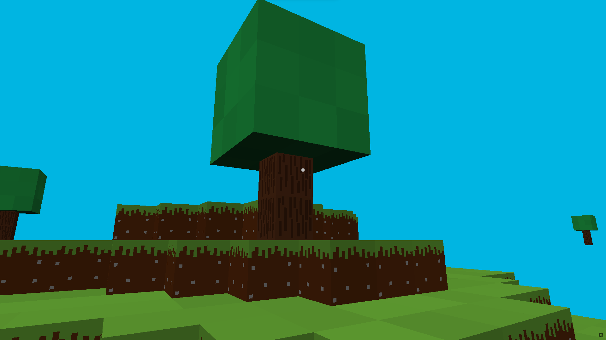

# Pyinecraft

Pyinecraft is a simple minecraft clone made with Python.

## Bugs

You cannot break the blocks in the ground because, if you even break a block the hole (where the block was) will follow you.
   
## How To Play:

1 = Grass  
2 = Dirt  
3 = Stone  
4 = Cobblestone  
5 = Sand  
6 = Log  
7 = Planks  
8 = Obsidian  
9 = Ice  